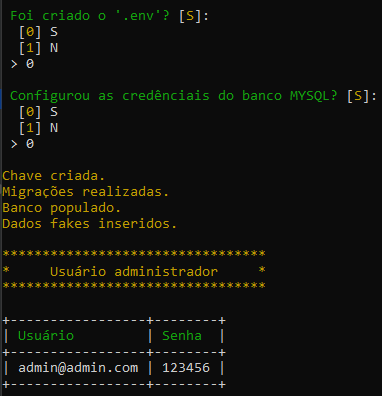

<p align="center">
</p>


Aplicação desafio Private CODE
------------------------------

Criado aplicação como forma de processo seletivo.

__Objetivo__: Desenvolver uma aplicação para gerir uma agenda telefônica com controle de acesso.

__Características__:
 - A aplicação deve ser responsiva;
 - Design é um grande diferencial;
 - Utilize Laravel;
 - É permitida a utilização de bibliotecas de terceiros;
 
 __Cenário__: 

O usuário acessa a aplicação e se cadastra. Após isso ele pode criar “Clientes”. Cada cliente pode ter um ou mais telefones. Para cada telefone devem haver dois botões: um link para telefone e um link para abrir uma conversa no WhatsApp.


A aplicação deve possuir um controle de grupos e níveis de acesso e o usuário principal pode cadastrar novos usuários dentro destes grupos. Claro que as ações do usuário ficarão limitadas às configurações de cada grupo criado.

__Dados da Aplicação__:

 - Tela Inicial:
   * Login
   * Botão de Cadastro
     * Nome
     * E-mail
     * Senha
 - Painel:
   * Cadastrar Clientes:
     * Nome
     * E-mail
   * Cada cliente pode ter vários telefones associados a ele;
   * Deve ser possível localizar um cliente por nome, e-mail ou telefone;
   * Para cada telefone listado, adicione:
     * Botão “Ligar” (link telefone);
     * Botão “WhatsApp” (link conversa WhatsApp);
   * Log de atividades
     * Cada ação no sistema (acesso ou alteração) deve ser registrada no sistema;
     * Cada usuário visualiza seu próprio log de atividades (a menos que seja o admin / criador da conta ou que possua permissão para visualizar o log de todos os usuários);
   * Gerenciamento de Usuários, Grupos e Permissões;
     * Deve ser possível criar grupos e delegar as seguintes permissões: 
       * Visualizar Telefones;
       * Editar / Excluir Telefone
       * Visualizar Log de Atividades (todos os usuários)
     * Criar novos usuários associados a um grupo;
   * Alterar senha de usuário logado;
   * Botão Logoff;

O código deve ser hospedado no Github com um README.md contendo as instruções de instalação para teste.

Prazo de Envio: 02/abr/2020 às 23 hrs.

Executar a aplicação
--------------------

Clonar projeto
```
$ git clone https://github.com/YOUR-USERNAME/YOUR-REPOSITORY
```
Instalar composer 
```
$ composer install
```

Configurar `.env` com as credências do banco `Mysql` 
```
  DB_CONNECTION=mysql
  DB_HOST=127.0.0.1
  DB_PORT=3306
  DB_DATABASE=laravel
  DB_USERNAME=root
  DB_PASSWORD=
```
Inciar a aplicação 
```
$ php artisan start:app
```




Caso ocorra tudo como esperado será retorando as credências do admin.


Adicionais
----------

Template usado na aplicação  `stisla` [GitHub](https://github.com/stisla/stisla)

Pacotes composer:
 * Tradução de erros | `laravel-pt-BR-localization` [GitHub](https://github.com/lucascudo/laravel-pt-BR-localization)
 * Auditoria | `laravel-activitylog` [GitHub](https://github.com/spatie/laravel-activitylog)
 * ACL | `laravel-permission` [GitHub](https://github.com/spatie/laravel-permission)
